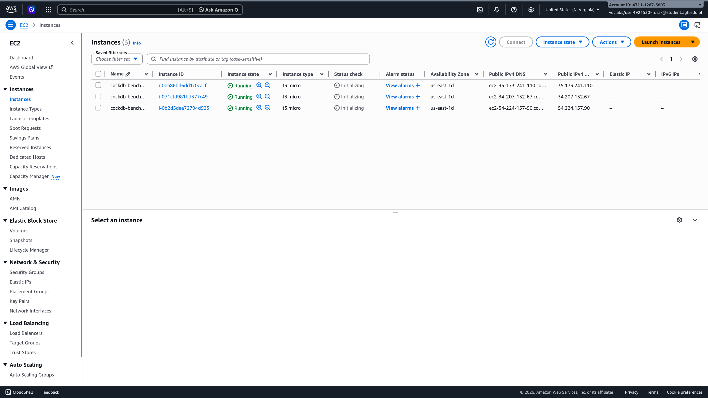
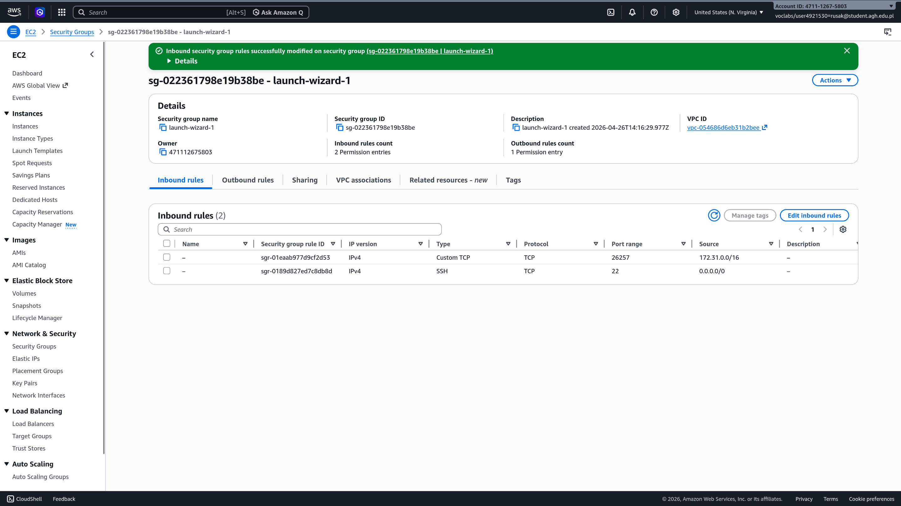
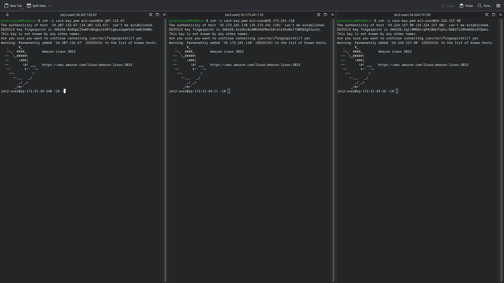

# LOCAL

```bash
piotrrusak@fedora:~/Agh/lsc-db-benchmark/cockroach-v24.1.0.linux-amd64$ ./cockroach start --insecure \
  --store=node1 \
  --listen-addr=localhost:26257 \
  --http-addr=localhost:8080 \
  --join=localhost:26257,localhost:26258,localhost:26259 \
  --background
*
* WARNING: ALL SECURITY CONTROLS HAVE BEEN DISABLED!
* 
* This mode is intended for non-production testing only.
* 
* In this mode:
* - Your cluster is open to any client that can access localhost.
* - Intruders with access to your machine or network can observe client-server traffic.
* - Intruders can log in without password and read or write any data in the cluster.
* - Intruders can consume all your server's resources and cause unavailability.
*
*
* INFO: To start a secure server without mandating TLS for clients,
* consider --accept-sql-without-tls instead. For other options, see:
* 
* - https://go.crdb.dev/issue-v/53404/v24.1
* - https://www.cockroachlabs.com/docs/v24.1/secure-a-cluster.html
*
*
* WARNING: Running a server without --sql-addr, with a combined RPC/SQL listener, is deprecated.
* This feature will be removed in a later version of CockroachDB.
*
*
* INFO: initial startup completed.
* Node will now attempt to join a running cluster, or wait for `cockroach init`.
* Client connections will be accepted after this completes successfully.
* Check the log file(s) for progress. 
```

```bash
piotrrusak@fedora:~/Agh/lsc-db-benchmark/cockroach-v24.1.0.linux-amd64$ ./cockroach start --insecure \
  --store=node2 \
  --listen-addr=localhost:26258 \
  --http-addr=localhost:8081 \
  --join=localhost:26257,localhost:26258,localhost:26259 \
  --background
*
* WARNING: ALL SECURITY CONTROLS HAVE BEEN DISABLED!
* 
* This mode is intended for non-production testing only.
* 
* In this mode:
* - Your cluster is open to any client that can access localhost.
* - Intruders with access to your machine or network can observe client-server traffic.
* - Intruders can log in without password and read or write any data in the cluster.
* - Intruders can consume all your server's resources and cause unavailability.
*
*
* INFO: To start a secure server without mandating TLS for clients,
* consider --accept-sql-without-tls instead. For other options, see:
* 
* - https://go.crdb.dev/issue-v/53404/v24.1
* - https://www.cockroachlabs.com/docs/v24.1/secure-a-cluster.html
*
*
* WARNING: Running a server without --sql-addr, with a combined RPC/SQL listener, is deprecated.
* This feature will be removed in a later version of CockroachDB.
*
*
* INFO: initial startup completed.
* Node will now attempt to join a running cluster, or wait for `cockroach init`.
* Client connections will be accepted after this completes successfully.
* Check the log file(s) for progress. 
```

```bash
piotrrusak@fedora:~/Agh/lsc-db-benchmark/cockroach-v24.1.0.linux-amd64$ ./cockroach start --insecure \
  --store=node3 \
  --listen-addr=localhost:26259 \
  --http-addr=localhost:8082 \
  --join=localhost:26257,localhost:26258,localhost:26259 \
  --background
*
* WARNING: ALL SECURITY CONTROLS HAVE BEEN DISABLED!
* 
* This mode is intended for non-production testing only.
* 
* In this mode:
* - Your cluster is open to any client that can access localhost.
* - Intruders with access to your machine or network can observe client-server traffic.
* - Intruders can log in without password and read or write any data in the cluster.
* - Intruders can consume all your server's resources and cause unavailability.
*
*
* INFO: To start a secure server without mandating TLS for clients,
* consider --accept-sql-without-tls instead. For other options, see:
* 
* - https://go.crdb.dev/issue-v/53404/v24.1
* - https://www.cockroachlabs.com/docs/v24.1/secure-a-cluster.html
*
*
* WARNING: Running a server without --sql-addr, with a combined RPC/SQL listener, is deprecated.
* This feature will be removed in a later version of CockroachDB.
*
*
* INFO: initial startup completed.
* Node will now attempt to join a running cluster, or wait for `cockroach init`.
* Client connections will be accepted after this completes successfully.
* Check the log file(s) for progress. 
```

```bash
piotrrusak@fedora:~/Agh/lsc-db-benchmark/cockroach-v24.1.0.linux-amd64$ ./cockroach init --insecure --host=localhost:26257
Cluster successfully initialized
```

```bash
piotrrusak@fedora:~/Agh/lsc-db-benchmark/cockroach-v24.1.0.linux-amd64$ ./cockroach node status --insecure --host=localhost:26257
  id |     address     |   sql_address   |  build  |              started_at              |              updated_at              | locality | is_available | is_live
-----+-----------------+-----------------+---------+--------------------------------------+--------------------------------------+----------+--------------+----------
   1 | localhost:26257 | localhost:26257 | v24.1.0 | 2026-04-25 16:37:47.143047 +0000 UTC | 2026-04-25 16:37:56.162934 +0000 UTC |          | true         | true
   2 | localhost:26259 | localhost:26259 | v24.1.0 | 2026-04-25 16:37:47.284401 +0000 UTC | 2026-04-25 16:37:56.294992 +0000 UTC |          | true         | true
   3 | localhost:26258 | localhost:26258 | v24.1.0 | 2026-04-25 16:37:48.20524 +0000 UTC  | 2026-04-25 16:37:57.221374 +0000 UTC |          | true         | true
(3 rows)
```

```bash
piotrrusak@fedora:~/Agh/lsc-db-benchmark/cockroach-v24.1.0.linux-amd64$ ./cockroach workload init bank 'postgresql://root@localhost:26257?sslmode=disable' --drop
I260425 16:49:27.315495 1 workload/cli/run.go:639  [-] 1  random seed: 2480145024524052267
I260425 16:49:27.336919 1 ccl/workloadccl/fixture.go:315  [-] 2  starting import of 1 tables
I260425 16:49:27.646221 35 ccl/workloadccl/fixture.go:492  [-] 3  imported 121 KiB in bank table (1000 rows, 0 index entries, took 275.062871ms, 0.43 MiB/s)
I260425 16:49:27.646299 1 ccl/workloadccl/fixture.go:323  [-] 4  imported 121 KiB bytes in 1 tables (took 309.319444ms, 0.38 MiB/s)
I260425 16:49:27.669880 1 workload/workloadsql/workloadsql.go:148  [-] 5  starting 9 splits
```

With three active nodes and initialised bank, I ran a benchmark:

```bash
piotrrusak@fedora:~/Agh/lsc-db-benchmark/cockroach-v24.1.0.linux-amd64$ ./cockroach workload run bank 'postgresql://root@localhost:26257?sslmode=disable' --duration=2m
I260425 16:49:34.202769 1 workload/cli/run.go:639  [-] 1  random seed: 12728946649237182712
I260425 16:49:34.202884 1 workload/cli/run.go:431  [-] 2  creating load generator...
I260425 16:49:34.212618 1 workload/cli/run.go:470  [-] 3  creating load generator... done (took 9.733297ms)
_elapsed___errors__ops/sec(inst)___ops/sec(cum)__p50(ms)__p95(ms)__p99(ms)_pMax(ms)
    1.0s        0          656.2          662.7      8.9     24.1    771.8   1006.6 transfer
    2.0s        0          977.3          820.0     17.8     54.5     96.5   1677.7 transfer
    3.0s        0         1283.4          974.5     12.6     46.1    142.6    486.5 transfer
    4.0s        0         1399.5         1080.7     12.6     39.8    151.0    260.0 transfer
    5.0s        0         1445.1         1153.6     14.2     37.7     60.8    218.1 transfer
    6.0s        0         1514.2         1213.7     13.6     33.6     54.5     75.5 transfer
    7.0s        0         1445.8         1246.8     13.1     39.8     88.1    192.9 transfer
    8.0s        0         1358.4         1260.8     14.2     46.1     67.1    209.7 transfer
    9.0s        0         1433.5         1280.0     14.2     39.8     58.7    104.9 transfer
   10.0s        0         1351.8         1287.2     14.7     39.8     67.1    104.9 transfer
   11.0s        0         1404.2         1297.8     14.2     35.7     62.9    251.7 transfer
   12.0s        0         1761.2         1336.4     11.5     30.4     46.1    218.1 transfer
   13.0s        0         1791.9         1371.5     11.5     29.4     41.9     96.5 transfer
   14.0s        0         1696.8         1394.7     11.5     35.7     54.5    104.9 transfer
   15.0s        0         1672.8         1413.2     11.0     35.7     60.8    209.7 transfer
   16.0s        0         1696.9         1431.0     11.0     31.5     60.8    302.0 transfer
   17.0s        0         1715.4         1447.7     12.1     32.5     48.2    159.4 transfer
   18.0s        0         1470.7         1449.0     13.6     32.5     52.4    104.9 transfer
   19.0s        0         1458.0         1449.4     13.6     37.7     56.6    100.7 transfer
   20.0s        0         1457.3         1449.8     13.6     35.7     60.8     88.1 transfer
_elapsed___errors__ops/sec(inst)___ops/sec(cum)__p50(ms)__p95(ms)__p99(ms)_pMax(ms)
   21.0s        0         1434.1         1449.1     14.2     37.7     62.9    184.5 transfer
   22.0s        0         1524.7         1452.5     13.1     35.7     50.3     71.3 transfer
   23.0s        0         1593.1         1458.6     13.1     32.5     52.4     79.7 transfer
   24.0s        0         1405.6         1456.4     14.2     37.7     56.6     83.9 transfer
   25.0s        0         1481.8         1457.4     13.6     37.7     54.5     79.7 transfer
   26.0s        0         1556.8         1461.3     12.6     35.7     56.6     83.9 transfer
   27.0s        0         1290.1         1454.9     16.3     39.8     65.0    117.4 transfer
   28.0s        0         1140.6         1443.6     18.9     41.9     71.3    109.1 transfer
   29.0s        0         1445.2         1443.7     14.7     35.7     54.5    104.9 transfer
   30.0s        0         1581.5         1448.3     13.1     32.5     52.4     83.9 transfer
   31.0s        0         1356.7         1445.3     13.6     44.0     67.1    159.4 transfer
   32.0s        0         1124.9         1435.3     18.9     48.2     71.3    151.0 transfer
   33.0s        0         1440.4         1435.5     14.2     37.7     58.7     75.5 transfer
   34.0s        0         1507.8         1437.6     14.2     35.7     52.4     79.7 transfer
   35.0s        0         1456.6         1438.1     13.6     35.7     50.3     96.5 transfer
   36.0s        0         1439.2         1438.2     14.2     35.7     52.4     79.7 transfer
   37.0s        0         1446.2         1438.4     14.2     35.7     50.3     67.1 transfer
   38.0s        0         1533.0         1440.9     13.6     31.5     52.4     71.3 transfer
   39.0s        0         1332.5         1438.1     15.7     39.8     56.6     92.3 transfer
   40.0s        0         1309.0         1434.9     15.2     37.7     65.0    419.4 transfer
_elapsed___errors__ops/sec(inst)___ops/sec(cum)__p50(ms)__p95(ms)__p99(ms)_pMax(ms)
   41.0s        0         1304.9         1431.7     16.3     39.8     56.6     71.3 transfer
   42.0s        0         1330.1         1429.3     15.7     39.8     58.7    104.9 transfer
   43.0s        0         1176.6         1423.4     16.8     44.0     62.9     92.3 transfer
   44.0s        0         1243.7         1419.3     16.8     39.8     67.1    318.8 transfer
   45.0s        0         1260.4         1415.8     15.2     48.2     83.9    335.5 transfer
   46.0s        0         1326.9         1413.9     15.7     39.8     67.1    159.4 transfer
   47.0s        0         1320.6         1411.9     15.7     37.7     56.6    100.7 transfer
   48.0s        0         1190.0         1407.2     17.8     41.9     60.8     83.9 transfer
   49.0s        0         1300.3         1405.1     16.8     35.7     54.5     88.1 transfer
   50.0s        0         1215.9         1401.3     17.8     39.8     60.8     92.3 transfer
   51.0s        0         1144.0         1396.2     17.8     50.3     75.5    121.6 transfer
   52.0s        0         1314.3         1394.7     15.7     41.9     56.6     88.1 transfer
   53.0s        0         1416.5         1395.1     13.6     39.8     79.7    125.8 transfer
   54.0s        0         1377.9         1394.8     15.2     37.7     56.6    109.1 transfer
   55.0s        0         1271.5         1392.5     16.8     39.8     56.6    117.4 transfer
   56.0s        0         1237.6         1389.7     16.3     46.1     67.1     96.5 transfer
   57.0s        0         1240.0         1387.1     17.8     39.8     58.7     92.3 transfer
   58.0s        0         1197.4         1383.8     16.8     46.1     67.1    125.8 transfer
   59.0s        0         1216.0         1381.0     17.8     39.8     60.8    104.9 transfer
   60.0s        0         1099.8         1376.3     19.9     44.0     62.9     92.3 transfer
_elapsed___errors__ops/sec(inst)___ops/sec(cum)__p50(ms)__p95(ms)__p99(ms)_pMax(ms)
   61.0s        0         1095.3         1371.7     19.9     46.1     60.8     92.3 transfer
   62.0s        0         1005.5         1365.8     21.0     48.2     83.9    109.1 transfer
   63.0s        0          948.0         1359.2     22.0     52.4     88.1    121.6 transfer
   64.0s        0          942.6         1352.7     23.1     48.2     71.3    117.4 transfer
   65.0s        0          855.4         1345.0     25.2     58.7     96.5    184.5 transfer
   66.0s        0          936.4         1338.8     22.0     54.5     83.9    121.6 transfer
   67.0s        0          899.1         1332.3     23.1     54.5     79.7    302.0 transfer
   68.0s        0          928.7         1326.3     23.1     58.7     92.3    151.0 transfer
   69.0s        0         1075.6         1322.7     19.9     48.2     79.7    142.6 transfer
   70.0s        0         1080.1         1319.2     19.9     46.1     75.5    167.8 transfer
   71.0s        0         1025.3         1315.1     18.9     48.2     83.9    385.9 transfer
   72.0s        0          873.1         1308.9     25.2     52.4     75.5    104.9 transfer
   73.0s        0         1036.3         1305.2     21.0     48.2     65.0     75.5 transfer
   74.0s        0          969.1         1300.7     22.0     54.5     79.7    151.0 transfer
   75.0s        0         1129.1         1298.4     17.8     54.5     71.3    100.7 transfer
   76.0s        0         1276.7         1298.1     16.3     41.9     54.5    109.1 transfer
   77.0s        0         1221.2         1297.1     16.8     44.0     62.9    184.5 transfer
   78.0s        0         1141.8         1295.1     17.8     48.2     67.1    100.7 transfer
   79.0s        0         1091.3         1292.5     17.8     52.4     79.7    125.8 transfer
   80.0s        0         1072.0         1289.8     19.9     48.2     71.3    142.6 transfer
_elapsed___errors__ops/sec(inst)___ops/sec(cum)__p50(ms)__p95(ms)__p99(ms)_pMax(ms)
   81.0s        0         1087.8         1287.3     18.9     46.1     71.3    121.6 transfer
   82.0s        0         1006.0         1283.9     19.9     50.3     83.9    142.6 transfer
   83.0s        0          949.8         1279.8     23.1     54.5     75.5    130.0 transfer
   84.0s        0          843.5         1274.6     25.2     62.9    104.9    251.7 transfer
   85.0s        0          969.5         1271.0     21.0     52.4     71.3    109.1 transfer
   86.0s        0          919.1         1267.0     22.0     52.4     79.7    130.0 transfer
   87.0s        0         1040.0         1264.3     21.0     54.5     75.5    159.4 transfer
   88.0s        0         1036.5         1261.8     19.9     52.4     75.5    125.8 transfer
   89.0s        0         1302.7         1262.2     15.7     39.8     58.7     83.9 transfer
   90.0s        0         1202.2         1261.5     17.8     44.0     65.0     75.5 transfer
   91.0s        0         1301.9         1262.0     15.2     41.9     71.3    226.5 transfer
   92.0s        0         1363.4         1263.1     15.2     37.7     62.9    109.1 transfer
   93.0s        0         1317.9         1263.7     15.7     41.9     60.8     96.5 transfer
   94.0s        0         1309.8         1264.2     15.7     39.8     62.9    130.0 transfer
   95.0s        0         1336.6         1264.9     15.7     39.8     58.7     75.5 transfer
   96.0s        0         1318.9         1265.5     15.2     41.9     65.0    100.7 transfer
   97.0s        0         1287.5         1265.7     15.7     44.0     71.3    130.0 transfer
   98.0s        0         1311.3         1266.2     16.3     41.9     60.8     83.9 transfer
   99.0s        0         1307.3         1266.6     15.7     39.8     58.7     88.1 transfer
  100.0s        0         1302.1         1267.0     16.3     39.8     60.8     83.9 transfer
_elapsed___errors__ops/sec(inst)___ops/sec(cum)__p50(ms)__p95(ms)__p99(ms)_pMax(ms)
  101.0s        0         1267.7         1267.0     16.3     39.8     62.9    100.7 transfer
  102.0s        0         1276.5         1267.1     16.3     41.9     58.7    100.7 transfer
  103.0s        0         1305.3         1267.4     16.3     39.8     58.7    117.4 transfer
  104.0s        0         1266.7         1267.4     16.8     39.8     54.5     83.9 transfer
  105.0s        0         1302.9         1267.8     16.3     37.7     60.8     92.3 transfer
  106.0s        0         1180.4         1266.9     16.8     46.1     79.7    151.0 transfer
  107.0s        0         1340.4         1267.6     15.2     39.8     62.9     96.5 transfer
  108.0s        0         1355.8         1268.4     15.7     39.8     52.4     92.3 transfer
  109.0s        0         1221.7         1268.0     16.8     44.0     71.3    318.8 transfer
  110.0s        0         1282.6         1268.1     16.3     41.9     58.7    125.8 transfer
  111.0s        0         1347.9         1268.9     15.2     39.8     65.0    218.1 transfer
  112.0s        0         1358.2         1269.7     15.7     35.7     56.6     75.5 transfer
  113.0s        0         1366.6         1270.5     15.2     39.8     54.5    100.7 transfer
  114.0s        0         1373.3         1271.4     15.2     39.8     56.6     79.7 transfer
  115.0s        0         1343.9         1272.1     15.7     37.7     58.7    100.7 transfer
  116.0s        0         1347.1         1272.7     15.2     41.9     58.7     79.7 transfer
  117.0s        0         1225.3         1272.3     15.7     50.3     79.7    130.0 transfer
  118.0s        0         1293.9         1272.5     15.7     39.8     60.8     88.1 transfer
  119.0s        0         1262.9         1272.4     16.3     39.8     75.5    109.1 transfer
  120.0s        0         1289.9         1272.5     15.7     44.0     65.0     96.5 transfer

_elapsed___errors_____ops(total)___ops/sec(cum)__avg(ms)__p50(ms)__p95(ms)__p99(ms)_pMax(ms)__total
  120.0s        0         152706         1272.5     18.9     15.7     41.9     67.1   1677.7  transfer

_elapsed___errors_____ops(total)___ops/sec(cum)__avg(ms)__p50(ms)__p95(ms)__p99(ms)_pMax(ms)__result
  120.0s        0         152706         1272.5     18.9     15.7     41.9     67.1   1677.7  
```

After full benchmark, I tested what if second node dies while benchmarking:

```bash
piotrrusak@fedora:~/Agh/lsc-db-benchmark/cockroach-v24.1.0.linux-amd64$ ./cockroach workload run bank 'postgresql://root@localhost:26257?sslmode=disable' --duration=5m
I260425 16:54:22.791269 1 workload/cli/run.go:639  [-] 1  random seed: 11146626805739849253
I260425 16:54:22.791336 1 workload/cli/run.go:431  [-] 2  creating load generator...
I260425 16:54:22.792930 1 workload/cli/run.go:470  [-] 3  creating load generator... done (took 1.592697ms)
_elapsed___errors__ops/sec(inst)___ops/sec(cum)__p50(ms)__p95(ms)__p99(ms)_pMax(ms)
    1.0s        0          442.0          442.8      7.9     17.8    771.8    906.0 transfer
    2.0s        0         1321.2          882.0     11.5     32.5     67.1   1744.8 transfer
    3.0s        0         1480.3         1081.3     13.1     37.7     75.5   2080.4 transfer
    4.0s        0         1468.3         1178.0     13.1     37.7     65.0    100.7 transfer
    5.0s        0         1472.2         1236.9     13.6     35.7     60.8    134.2 transfer
    6.0s        0         1470.3         1275.7     13.6     37.7     60.8    117.4 transfer
    7.0s        0         1428.5         1297.6     12.1     37.7    142.6    402.7 transfer
    8.0s        0         1465.9         1318.6     14.2     35.7     54.5    130.0 transfer
    9.0s        0         1364.3         1323.7     15.2     41.9     67.1    142.6 transfer
   10.0s        0         1348.4         1326.1     14.7     39.8     71.3    201.3 transfer
   11.0s        0         1219.4         1316.4     15.2     41.9    121.6    285.2 transfer
   12.0s        0         1413.8         1324.6     13.6     39.8     88.1    268.4 transfer
   13.0s        0         1388.0         1329.4     14.2     41.9     65.0     88.1 transfer
   14.0s        0         1439.5         1337.3     14.7     37.7     52.4     79.7 transfer
   15.0s        0         1445.6         1344.5     14.2     37.7     62.9     83.9 transfer
   16.0s        0         1383.1         1346.9     14.7     37.7     71.3    218.1 transfer
   17.0s        0         1389.9         1349.5     14.7     39.8     71.3    100.7 transfer
   18.0s        0         1366.6         1350.4     14.7     41.9     65.0     92.3 transfer
   19.0s        0         1383.9         1352.2     14.7     39.8     62.9     92.3 transfer
   20.0s        0         1272.7         1348.2     15.2     46.1     71.3    121.6 transfer
_elapsed___errors__ops/sec(inst)___ops/sec(cum)__p50(ms)__p95(ms)__p99(ms)_pMax(ms)
   21.0s        0         1336.6         1347.7     14.7     37.7     67.1    385.9 transfer
   22.0s        0         1341.1         1347.4     15.7     37.7     56.6     96.5 transfer
   23.0s        0         1295.3         1345.1     16.3     37.7     60.8     92.3 transfer
   24.0s        0         1369.6         1346.1     14.7     41.9     60.8     88.1 transfer
   25.0s        0         1437.9         1349.8     14.2     37.7     56.6     88.1 transfer
   26.0s        0         1159.3         1342.5     17.8     46.1     71.3    100.7 transfer
   27.0s        0         1332.6         1342.1     15.2     39.8     60.8     92.3 transfer
   28.0s        0         1398.7         1344.1     13.6     44.0     67.1    335.5 transfer
   29.0s        0         1415.1         1346.6     13.6     37.7     62.9    142.6 transfer
   30.0s        0         1327.4         1345.9     12.1     33.6    121.6    906.0 transfer
   31.0s        0          443.3         1316.8     14.7     35.7    117.4    805.3 transfer
   32.0s        0            0.0         1275.6      0.0      0.0      0.0      0.0 transfer
   33.0s        0            0.0         1237.0      0.0      0.0      0.0      0.0 transfer
   34.0s        0            0.0         1200.6      0.0      0.0      0.0      0.0 transfer
   35.0s        0            0.0         1166.3      0.0      0.0      0.0      0.0 transfer
   36.0s        0            0.0         1133.9      0.0      0.0      0.0      0.0 transfer
Error: pq: result is ambiguous: error=ba: Put [/Table/106/1/400/0], EndTxn(parallel commit) [/Table/106/1/400/0], [txn: 2cce471c] RPC error: grpc: error reading from server: read tcp 127.0.0.1:54952->127.0.0.1:26258: read: connection reset by peer [code 14/Unavailable] [exhausted] (last error: routing information detected to be stale: [NotLeaseHolderError] lease held by different store; r73: replica (n3,s3):2 not lease holder; current lease is repl=(n2,s2):3 seq=3 start=1777135826.439980668,0 epo=1 pro=1777135826.450045745,0)
```

After killing node2 during the workload, throughput dropped from ~1350 ops/sec to 0 ops/sec for several seconds. This temporary unavailability is caused by Raft leader election and leaseholder transfer. The client observed an ambiguous result error caused by connection reset and leaseholder change. This shows that CockroachDB prioritizes consistency: instead of returning possibly incorrect results, it reports uncertainty and requires the client to retry.

After that test I revived node2:

```bash
piotrrusak@fedora:~/Agh/lsc-db-benchmark/cockroach-v24.1.0.linux-amd64$ ./cockroach start --insecure \
  --store=node2 \
  --listen-addr=localhost:26258 \
  --http-addr=localhost:8081 \
  --join=localhost:26257,localhost:26258,localhost:26259 \
  --background
*
* WARNING: ALL SECURITY CONTROLS HAVE BEEN DISABLED!
* 
* This mode is intended for non-production testing only.
* 
* In this mode:
* - Your cluster is open to any client that can access localhost.
* - Intruders with access to your machine or network can observe client-server traffic.
* - Intruders can log in without password and read or write any data in the cluster.
* - Intruders can consume all your server's resources and cause unavailability.
*
*
* INFO: To start a secure server without mandating TLS for clients,
* consider --accept-sql-without-tls instead. For other options, see:
* 
* - https://go.crdb.dev/issue-v/53404/v24.1
* - https://www.cockroachlabs.com/docs/v24.1/secure-a-cluster.html
*
*
* WARNING: Running a server without --sql-addr, with a combined RPC/SQL listener, is deprecated.
* This feature will be removed in a later version of CockroachDB.
*
```

```bash
piotrrusak@fedora:~/Agh/lsc-db-benchmark/cockroach-v24.1.0.linux-amd64$ ./cockroach node status --insecure --host=localhost:26257
  id |     address     |   sql_address   |  build  |              started_at              |              updated_at              | locality | is_available | is_live
-----+-----------------+-----------------+---------+--------------------------------------+--------------------------------------+----------+--------------+----------
   1 | localhost:26257 | localhost:26257 | v24.1.0 | 2026-04-25 16:48:30.501195 +0000 UTC | 2026-04-25 17:41:03.517383 +0000 UTC |          | true         | true
   2 | localhost:26258 | localhost:26258 | v24.1.0 | 2026-04-25 17:40:23.777988 +0000 UTC | 2026-04-25 17:41:02.798906 +0000 UTC |          | true         | true
   3 | localhost:26259 | localhost:26259 | v24.1.0 | 2026-04-25 16:48:32.039445 +0000 UTC | 2026-04-25 17:41:02.05079 +0000 UTC  |          | true         | true
(3 rows)
```

And after I ensured that all three nodes are alive I tested what if third node dies while benchmarking:

```bash
piotrrusak@fedora:~/Agh/lsc-db-benchmark/cockroach-v24.1.0.linux-amd64$ ./cockroach workload run bank 'postgresql://root@localhost:26257?sslmode=disable' --duration=5m
I260425 17:42:14.560950 1 workload/cli/run.go:639  [-] 1  random seed: 13914126934278834086
I260425 17:42:14.561035 1 workload/cli/run.go:431  [-] 2  creating load generator...
I260425 17:42:14.562258 1 workload/cli/run.go:470  [-] 3  creating load generator... done (took 1.222959ms)
_elapsed___errors__ops/sec(inst)___ops/sec(cum)__p50(ms)__p95(ms)__p99(ms)_pMax(ms)
    1.0s        0          545.0          545.8      8.1     17.8    838.9    973.1 transfer
    2.0s        0         1079.1          812.4     12.1     37.7     83.9   1744.8 transfer
    3.0s        0         1364.0          996.3     13.1     35.7    125.8   2415.9 transfer
    4.0s        0         1254.3         1060.9     16.3     41.9     75.5    104.9 transfer
    5.0s        0         1284.8         1105.5     16.3     39.8     56.6     92.3 transfer
    6.0s        0         1156.5         1114.1     17.8     44.0     62.9    151.0 transfer
    7.0s        0         1251.6         1133.7     14.2     44.0     88.1    469.8 transfer
    8.0s        0         1346.3         1160.3     14.7     41.9     83.9    260.0 transfer
    9.0s        0         1207.3         1165.5     15.2     50.3     75.5    142.6 transfer
   10.0s        0         1220.7         1171.0     15.7     48.2     79.7    117.4 transfer
   11.0s        0         1403.9         1192.2     12.6     41.9    151.0    192.9 transfer
   12.0s        0         1480.0         1216.2     13.6     37.7     56.6     96.5 transfer
   13.0s        0         1432.5         1232.8     14.7     35.7     54.5     67.1 transfer
   14.0s        0          712.2         1195.6     14.2     37.7     54.5    176.2 transfer
   15.0s        0            0.0         1116.0      0.0      0.0      0.0      0.0 transfer
   16.0s        0            0.0         1046.2      0.0      0.0      0.0      0.0 transfer
   17.0s        0            0.0          984.7      0.0      0.0      0.0      0.0 transfer
Error: pq: result is ambiguous: error=result is ambiguous: error=failed to connect to n3 at localhost:26259: grpc: connection error: desc = "transport: error while dialing: connection interrupted (did the remote node shut down or are there networking issues?)" [code 14/Unavailable] [exhausted] (last error: failed to connect to n3 at localhost:26259: grpc: connection error: desc = "transport: error while dialing: connection interrupted (did the remote node shut down or are there networking issues?)" [code 14/Unavailable]) [exhausted] (last error: result is ambiguous: error=failed to connect to n3 at localhost:26259: grpc: connection error: desc = "transport: error while dialing: connection interrupted (did the remote node shut down or are there networking issues?)" [code 14/Unavailable] [exhausted] (last error: failed to connect to n3 at localhost:26259: grpc: connection error: desc = "transport: error while dialing: connection interrupted (did the remote node shut down or are there networking issues?)" [code 14/Unavailable]))
```

During node failure, the system experienced a temporary drop in throughput and increased latency. This behavior is caused by Raft leader re-election and leaseholder transfer. After a short recovery period, the system resumed normal operation, demonstrating fault tolerance with strong consistency guarantees.

Then, I wanted to figure out what if error wouldn't terminate the benchmark:

```bash
piotrrusak@fedora:~/Agh/lsc-db-benchmark/cockroach-v24.1.0.linux-amd64$ ./cockroach workload run bank   'postgresql://root@localhost:26257?sslmode=disable'   --duration=5m   --tolerate-errors
I260425 18:00:01.342215 1 workload/cli/run.go:639  [-] 1  random seed: 6875242170990325666
I260425 18:00:01.342305 1 workload/cli/run.go:431  [-] 2  creating load generator...
I260425 18:00:01.343676 1 workload/cli/run.go:470  [-] 3  creating load generator... done (took 1.369974ms)
_elapsed___errors__ops/sec(inst)___ops/sec(cum)__p50(ms)__p95(ms)__p99(ms)_pMax(ms)
    1.0s        0           83.8           84.0      7.1     15.2    113.2    121.6 transfer
    2.0s        0          368.8          226.4      8.9     23.1   1879.0   2013.3 transfer
    3.0s        0         1166.6          539.6     12.1     79.7    151.0   2415.9 transfer
    4.0s        0         1146.6          691.4     11.5     83.9    159.4    243.3 transfer
    5.0s        0         1159.1          785.0     13.1     60.8    159.4    302.0 transfer
    6.0s        0         1165.7          848.4     12.6     75.5    201.3    419.4 transfer
    7.0s        0         1063.5          879.1     15.2     71.3    159.4    260.0 transfer
    8.0s        0         1180.4          916.8     16.8     44.0    100.7    167.8 transfer
    9.0s        0         1135.6          941.1     15.2     50.3    134.2    385.9 transfer
   10.0s        0         1070.2          954.0     13.6     44.0    285.2    352.3 transfer
   11.0s        0         1171.7          973.8     12.1     39.8    234.9    671.1 transfer
   12.0s        0         1038.9          979.2     14.7     37.7    121.6    704.6 transfer
   13.0s        0            0.0          903.9      0.0      0.0      0.0      0.0 transfer
   14.0s        0            0.0          839.3      0.0      0.0      0.0      0.0 transfer
   15.0s        0            0.0          783.4      0.0      0.0      0.0      0.0 transfer
   16.0s        0            0.0          734.4      0.0      0.0      0.0      0.0 transfer
   17.0s        0           20.0          692.4   5368.7   5368.7   5368.7   5368.7 transfer
E260425 18:00:18.390183 1 workload/cli/run.go:568  [-] 4  pq: result is ambiguous: error=ba: Put [/Table/106/1/860/0], [txn: 84afc5e8] RPC error: grpc: error reading from server: read tcp 127.0.0.1:45618->127.0.0.1:26259: read: connection reset by peer [code 14/Unavailable] [exhausted] (last error: routing information detected to be stale: [NotLeaseHolderError] lease held by different store; r72: replica (n2,s2):3 not lease holder; current lease is repl=(n3,s3):2 seq=9 start=1777140009.541325632,0 epo=8 pro=1777140009.553806779,0)
   18.0s        2         1380.7          730.7     13.1     39.8     92.3   5905.6 transfer
   19.0s        2         1482.3          770.2     13.6     35.7     60.8    125.8 transfer
   20.0s        2         1462.7          804.8     14.2     37.7     54.5     83.9 transfer
_elapsed___errors__ops/sec(inst)___ops/sec(cum)__p50(ms)__p95(ms)__p99(ms)_pMax(ms)
   21.0s        2         1478.7          836.9     13.6     37.7     56.6    125.8 transfer
   22.0s        2         1482.2          866.3     13.6     35.7     58.7    125.8 transfer
   23.0s        2         1502.6          893.9     13.6     35.7     50.3    104.9 transfer
   24.0s        2         1519.4          920.0     14.2     35.7     50.3     62.9 transfer
   25.0s        2         1462.0          941.7     14.7     35.7     50.3     75.5 transfer
   26.0s        2         1475.3          962.3     14.2     35.7     50.3     75.5 transfer
   27.0s        2         1388.0          978.0     14.7     37.7     58.7    109.1 transfer
   28.0s        2         1376.5          992.2     15.7     37.7     56.6     79.7 transfer
   29.0s        2          961.6          991.2     21.0     54.5     79.7    117.4 transfer
   30.0s        2         1294.6         1001.3     15.2     44.0     83.9    130.0 transfer
   31.0s        2         1342.7         1012.3     15.2     41.9     58.7    117.4 transfer
   32.0s        2         1570.6         1029.7     13.1     37.7     54.5     71.3 transfer
   33.0s        2         1520.8         1044.6     13.1     35.7     50.3    251.7 transfer
   34.0s        2         1540.8         1059.2     13.6     35.7     50.3     79.7 transfer
   35.0s        2         1506.5         1072.0     13.6     37.7     52.4     92.3 transfer
   36.0s        2         1515.9         1084.3     13.6     35.7     54.5     92.3 transfer
   37.0s        2         1469.3         1094.7     13.6     39.8     58.7    104.9 transfer
   38.0s        2         1495.5         1105.3     13.6     37.7     52.4     96.5 transfer
   39.0s        2         1424.9         1113.5     14.2     37.7     54.5    113.2 transfer
   40.0s        2         1418.4         1121.1     14.2     39.8     60.8    113.2 transfer
_elapsed___errors__ops/sec(inst)___ops/sec(cum)__p50(ms)__p95(ms)__p99(ms)_pMax(ms)
   41.0s        2         1448.7         1129.1     14.2     37.7     54.5    100.7 transfer
   42.0s        2         1434.9         1136.4     14.7     35.7     50.3    104.9 transfer
   43.0s        2         1294.6         1140.0     16.3     39.8     56.6     83.9 transfer
   44.0s        2         1224.8         1142.0     16.8     44.0     60.8    121.6 transfer
   45.0s        2         1474.2         1149.4     14.7     35.7     50.3    100.7 transfer
   46.0s        2         1530.5         1157.6     13.1     35.7     52.4    192.9 transfer
   47.0s        2         1502.6         1165.0     13.1     35.7     50.3     71.3 transfer
   48.0s        2         1501.5         1172.0     13.6     39.8     58.7    109.1 transfer
   49.0s        2         1528.7         1179.3     13.6     35.7     48.2     75.5 transfer
   50.0s        2         1561.1         1186.9     13.6     30.4     50.3    209.7 transfer
   51.0s        2         1580.9         1194.6     13.6     32.5     46.1     60.8 transfer
   52.0s        2         1553.6         1201.5     13.1     35.7     52.4     83.9 transfer
   53.0s        2         1519.7         1207.5     13.6     35.7     48.2     71.3 transfer
   54.0s        2         1508.5         1213.1     13.6     35.7     52.4    159.4 transfer
   55.0s        2         1559.1         1219.4     13.1     35.7     58.7     88.1 transfer
   56.0s        2         1474.0         1223.9     13.1     39.8     67.1    268.4 transfer
   57.0s        2         1419.7         1227.4     14.2     37.7     71.3    151.0 transfer
   58.0s        2         1298.3         1228.6     15.7     44.0     60.8     96.5 transfer
   59.0s        2         1239.8         1228.8     16.8     44.0     62.9    192.9 transfer
   60.0s        2         1256.2         1229.2     16.3     41.9     65.0    268.4 transfer
_elapsed___errors__ops/sec(inst)___ops/sec(cum)__p50(ms)__p95(ms)__p99(ms)_pMax(ms)
```

As we can see, ops/sec briefly dropped to 0 and then recovered to previous values.

# AWS

Configurating AWS required 3 EC2 instances and security group that enables inbound tcp on 26257.
Each node was deployed on a separate EC2 instance within the same VPC to enable low-latency communication.







Baseline:

```bash
[ec2-user@ip-172-31-34-240 cockroach-v24.1.0.linux-amd64]$ ./cockroach workload run bank 'postgresql://root@172.31.34.240:26257?sslmode=disable' --duration=5m
I260426 14:59:28.344874 1 workload/cli/run.go:639  [-] 1  random seed: 9359561712330100429
I260426 14:59:28.345126 1 workload/cli/run.go:431  [-] 2  creating load generator...
I260426 14:59:28.780259 1 workload/cli/run.go:470  [-] 3  creating load generator... done (took 435.12857ms)
_elapsed___errors__ops/sec(inst)___ops/sec(cum)__p50(ms)__p95(ms)__p99(ms)_pMax(ms)
    1.0s        0          108.3          155.7     16.8     37.7    285.2    369.1 transfer
    2.0s        0          138.4          147.3     18.9     71.3    117.4    125.8 transfer
    3.0s        0            8.0          100.9    369.1    402.7    402.7    402.7 transfer
    4.0s        0            7.6           77.1    385.9    486.5    486.5    486.5 transfer
    5.0s        0            4.1           62.9   1073.7   1073.7   1073.7   1073.7 transfer
    6.0s        0            4.0           53.1   1073.7   1140.9   1140.9   1140.9 transfer
    7.0s        0            2.0           45.8   1006.6   1140.9   1140.9   1140.9 transfer
    8.0s        0            2.0           40.4   1811.9   1811.9   1811.9   1811.9 transfer
    9.0s        0            0.0           35.9      0.0      0.0      0.0      0.0 transfer
   10.0s        0            2.0           32.5   2684.4   2818.6   2818.6   2818.6 transfer
   11.0s        0            0.0           29.6      0.0      0.0      0.0      0.0 transfer
   12.0s        0            0.0           27.1      0.0      0.0      0.0      0.0 transfer
   13.0s        0            0.0           25.0      0.0      0.0      0.0      0.0 transfer
   14.0s        0            0.0           23.2      0.0      0.0      0.0      0.0 transfer
   15.0s        0            0.0           21.7      0.0      0.0      0.0      0.0 transfer
   16.0s        0            1.0           20.4   8321.5   8321.5   8321.5   8321.5 transfer
   17.0s        0            0.0           19.2      0.0      0.0      0.0      0.0 transfer
   18.0s        0            0.0           18.1      0.0      0.0      0.0      0.0 transfer
   19.0s        0            1.0           17.2  11811.2  11811.2  11811.2  11811.2 transfer
   20.0s        0            0.0           16.4      0.0      0.0      0.0      0.0 transfer
_elapsed___errors__ops/sec(inst)___ops/sec(cum)__p50(ms)__p95(ms)__p99(ms)_pMax(ms)
```

Recovery:

```bash
[ec2-user@ip-172-31-34-240 cockroach-v24.1.0.linux-amd64]$ ./cockroach workload run bank 'postgresql://root@172.31.34.240:26257?sslmode=disable' --duration=5m
I260426 15:01:36.117335 1 workload/cli/run.go:639  [-] 1  random seed: 3532145109929266603
I260426 15:01:36.446508 1 workload/cli/run.go:431  [-] 2  creating load generator...
I260426 15:03:40.540083 1 workload/cli/run.go:470  [-] 3  creating load generator... done (took 2m4.103914139s)
_elapsed___errors__ops/sec(inst)___ops/sec(cum)__p50(ms)__p95(ms)__p99(ms)_pMax(ms)
   45.0s        0            0.0            0.0  45097.2  45097.2  45097.2  45097.2 transfer
   46.0s        0            0.0            0.0      0.0      0.0      0.0      0.0 transfer
   47.0s        0            0.0            0.0      0.0      0.0      0.0      0.0 transfer
   48.0s        0            0.0            0.0      0.0      0.0      0.0      0.0 transfer
   49.0s        0            0.0            0.0      0.0      0.0      0.0      0.0 transfer
   50.0s        0            0.0            0.0      0.0      0.0      0.0      0.0 transfer
   51.0s        0            0.0            0.0      0.0      0.0      0.0      0.0 transfer
   52.0s        0            0.0            0.0      0.0      0.0      0.0      0.0 transfer
   53.0s        0            0.0            0.0      0.0      0.0      0.0      0.0 transfer
   54.0s        0            0.0            0.0      0.0      0.0      0.0      0.0 transfer
   55.0s        0            0.0            0.0      0.0      0.0      0.0      0.0 transfer
   56.0s        0            0.0            0.0      0.0      0.0      0.0      0.0 transfer
   57.0s        0            0.0            0.0      0.0      0.0      0.0      0.0 transfer
   58.0s        0            0.0            0.0      0.0      0.0      0.0      0.0 transfer
   59.0s        0            0.0            0.0      0.0      0.0      0.0      0.0 transfer
   60.0s        0            0.0            0.0      0.0      0.0      0.0      0.0 transfer
   61.0s        0            0.0            0.0      0.0      0.0      0.0      0.0 transfer
   62.0s        0            0.0            0.0      0.0      0.0      0.0      0.0 transfer
   63.0s        0            0.0            0.0      0.0      0.0      0.0      0.0 transfer
   64.1s        0            0.0            0.0      0.0      0.0      0.0      0.0 transfer
_elapsed___errors__ops/sec(inst)___ops/sec(cum)__p50(ms)__p95(ms)__p99(ms)_pMax(ms)
   65.0s        0            0.0            0.0      0.0      0.0      0.0      0.0 transfer
   66.0s        0            0.0            0.0      0.0      0.0      0.0      0.0 transfer
   67.0s        0            0.0            0.0      0.0      0.0      0.0      0.0 transfer
   68.0s        0            0.0            0.0      0.0      0.0      0.0      0.0 transfer
   69.0s        0            0.0            0.0      0.0      0.0      0.0      0.0 transfer
   70.0s        0            0.0            0.0      0.0      0.0      0.0      0.0 transfer
   71.0s        0            0.0            0.0      0.0      0.0      0.0      0.0 transfer
   72.0s        0            0.0            0.0      0.0      0.0      0.0      0.0 transfer
   73.0s        0            0.0            0.0      0.0      0.0      0.0      0.0 transfer
   74.0s        0            0.0            0.0      0.0      0.0      0.0      0.0 transfer
   75.0s        0            0.0            0.0      0.0      0.0      0.0      0.0 transfer
   76.0s        0            0.0            0.0      0.0      0.0      0.0      0.0 transfer
   77.0s        0            0.0            0.0      0.0      0.0      0.0      0.0 transfer
   78.0s        0            0.0            0.0      0.0      0.0      0.0      0.0 transfer
   79.0s        0            0.0            0.0      0.0      0.0      0.0      0.0 transfer
   80.0s        0            0.0            0.0      0.0      0.0      0.0      0.0 transfer
   81.1s        0            0.0            0.0      0.0      0.0      0.0      0.0 transfer
   82.1s        0            0.0            0.0      0.0      0.0      0.0      0.0 transfer
   83.0s        0            0.0            0.0      0.0      0.0      0.0      0.0 transfer
   84.0s        0            0.0            0.0      0.0      0.0      0.0      0.0 transfer
_elapsed___errors__ops/sec(inst)___ops/sec(cum)__p50(ms)__p95(ms)__p99(ms)_pMax(ms)
   85.0s        0            0.0            0.0      0.0      0.0      0.0      0.0 transfer
   86.0s        0            0.0            0.0      0.0      0.0      0.0      0.0 transfer
   87.0s        0            0.0            0.0      0.0      0.0      0.0      0.0 transfer
   88.0s        0            0.0            0.0      0.0      0.0      0.0      0.0 transfer
   89.0s        0            0.0            0.0      0.0      0.0      0.0      0.0 transfer
   90.0s        0            0.0            0.0      0.0      0.0      0.0      0.0 transfer
   91.0s        0            0.0            0.0      0.0      0.0      0.0      0.0 transfer
   92.0s        0            0.0            0.0      0.0      0.0      0.0      0.0 transfer
   93.0s        0            0.0            0.0      0.0      0.0      0.0      0.0 transfer
   94.0s        0            0.0            0.0      0.0      0.0      0.0      0.0 transfer
   95.0s        0            0.0            0.0      0.0      0.0      0.0      0.0 transfer
   96.0s        0            0.0            0.0      0.0      0.0      0.0      0.0 transfer
   97.0s        0            0.0            0.0      0.0      0.0      0.0      0.0 transfer
   98.0s        0            0.0            0.0      0.0      0.0      0.0      0.0 transfer
   99.0s        0            0.0            0.0      0.0      0.0      0.0      0.0 transfer
  100.1s        0            0.0            0.0      0.0      0.0      0.0      0.0 transfer
  101.1s        0            0.0            0.0      0.0      0.0      0.0      0.0 transfer
  102.1s        0            0.0            0.0      0.0      0.0      0.0      0.0 transfer
  103.0s        0            0.0            0.0      0.0      0.0      0.0      0.0 transfer
  104.1s        0            0.0            0.0      0.0      0.0      0.0      0.0 transfer
_elapsed___errors__ops/sec(inst)___ops/sec(cum)__p50(ms)__p95(ms)__p99(ms)_pMax(ms)
  105.1s        0            0.0            0.0      0.0      0.0      0.0      0.0 transfer
  106.0s        0            0.0            0.0      0.0      0.0      0.0      0.0 transfer
  107.0s        0            0.0            0.0      0.0      0.0      0.0      0.0 transfer
  108.0s        0            0.0            0.0      0.0      0.0      0.0      0.0 transfer
  109.0s        0            0.0            0.0      0.0      0.0      0.0      0.0 transfer
  110.0s        0            0.0            0.0      0.0      0.0      0.0      0.0 transfer
  111.1s        0            0.0            0.0      0.0      0.0      0.0      0.0 transfer
  112.1s        0            0.0            0.0      0.0      0.0      0.0      0.0 transfer
  113.1s        0            0.0            0.0      0.0      0.0      0.0      0.0 transfer
  114.0s        0            0.0            0.0      0.0      0.0      0.0      0.0 transfer
  115.0s        0            0.0            0.0      0.0      0.0      0.0      0.0 transfer
  116.0s        0            0.0            0.0      0.0      0.0      0.0      0.0 transfer
  117.0s        0            0.0            0.0      0.0      0.0      0.0      0.0 transfer
  118.0s        0            3.0            0.0 103079.2 103079.2 103079.2 103079.2 transfer
  119.0s        0          149.0            1.3     13.1     22.0   1342.2  77309.4 transfer
  120.0s        0          267.8            3.5     13.6     24.1     44.0     56.6 transfer
  121.0s        0          260.2            5.6     14.2     28.3     39.8     50.3 transfer
  122.0s        0          251.0            7.6     14.7     27.3     31.5     41.9 transfer
  123.0s        0          289.8            9.9     13.6     19.9     31.5     41.9 transfer
  124.0s        0          293.0           12.2     13.1     19.9     28.3     41.9 transfer
_elapsed___errors__ops/sec(inst)___ops/sec(cum)__p50(ms)__p95(ms)__p99(ms)_pMax(ms)
  125.0s        0          270.0           14.3     13.6     25.2     33.6     35.7 transfer
  126.0s        0          265.0           16.3     14.2     25.2     56.6     65.0 transfer
  127.0s        0          279.9           18.3     14.2     21.0     32.5     46.1 transfer
  128.0s        0           95.0           18.9     14.7     37.7    536.9    536.9 transfer
  129.0s        0            0.0           18.8      0.0      0.0      0.0      0.0 transfer
  130.0s        0            0.0           18.7      0.0      0.0      0.0      0.0 transfer
  131.0s        0            0.0           18.5      0.0      0.0      0.0      0.0 transfer
  132.0s        0            0.0           18.4      0.0      0.0      0.0      0.0 transfer
  133.0s        0            0.0           18.2      0.0      0.0      0.0      0.0 transfer
  134.0s        0            0.0           18.1      0.0      0.0      0.0      0.0 transfer
  135.0s        0            0.0           18.0      0.0      0.0      0.0      0.0 transfer
  136.0s        0            0.0           17.8      0.0      0.0      0.0      0.0 transfer
  137.0s        0            0.0           17.7      0.0      0.0      0.0      0.0 transfer
  138.0s        0            0.0           17.6      0.0      0.0      0.0      0.0 transfer
  139.0s        0            0.0           17.4      0.0      0.0      0.0      0.0 transfer
  140.0s        0            0.0           17.3      0.0      0.0      0.0      0.0 transfer
  141.0s        0            0.0           17.2      0.0      0.0      0.0      0.0 transfer
  142.0s        0            0.0           17.1      0.0      0.0      0.0      0.0 transfer
  143.0s        0           60.1           17.4     41.9  14495.5  15032.4  15032.4 transfer
  144.0s        0          151.8           18.3     19.9     58.7     92.3    100.7 transfer
_elapsed___errors__ops/sec(inst)___ops/sec(cum)__p50(ms)__p95(ms)__p99(ms)_pMax(ms)
  145.0s        0          277.3           20.1     14.7     22.0     26.2     37.7 transfer
  146.0s        0          285.0           21.9     13.6     21.0     30.4     50.3 transfer
  147.0s        0          284.2           23.7     13.6     21.0     29.4     41.9 transfer
  148.0s        0          294.9           25.5     13.1     21.0     27.3     39.8 transfer
  149.0s        0          275.9           27.2     14.2     21.0     27.3     35.7 transfer
  150.0s        0          276.9           28.9     13.6     23.1     32.5     46.1 transfer
  151.0s        0          298.1           30.7     13.1     19.9     25.2     79.7 transfer
  152.0s        0          282.9           32.3     14.2     21.0     29.4     32.5 transfer
  153.0s        0          285.1           34.0     13.6     22.0     27.3     46.1 transfer
  154.0s        0          296.9           35.7     13.1     22.0     25.2     41.9 transfer
  155.0s        0          269.0           37.2     14.2     26.2     41.9     44.0 transfer
  156.0s        0          277.0           38.7     14.2     22.0     29.4     44.0 transfer
  157.0s        0          239.7           40.0     15.2     33.6     46.1     58.7 transfer
  158.0s        0          255.2           41.4     15.2     25.2     41.9     60.8 transfer
  159.0s        0          273.0           42.8     14.2     24.1     37.7     46.1 transfer
  160.0s        0          251.7           44.1     15.2     26.2     33.6     41.9 transfer
  161.0s        0          281.3           45.6     13.6     23.1     29.4     37.7 transfer
  162.0s        0          124.7           46.1     27.3     75.5    109.1    113.2 transfer
  163.0s        0          210.9           47.1     16.3     37.7     88.1     88.1 transfer
  164.0s        0          238.4           48.3     15.7     30.4     46.1     58.7 transfer
_elapsed___errors__ops/sec(inst)___ops/sec(cum)__p50(ms)__p95(ms)__p99(ms)_pMax(ms)
```

Failure & recovery can be easily seen

After recovery test:

```bash
[ec2-user@ip-172-31-43-16 cockroach-v24.1.0.linux-amd64]$ ./cockroach node status --insecure --host=172.31.34.240:26257
  id |       address       |     sql_address     |  build  |              started_at              |              updated_at              | locality | is_available | is_live
-----+---------------------+---------------------+---------+--------------------------------------+--------------------------------------+----------+--------------+----------
   1 | 172.31.34.240:26257 | 172.31.34.240:26257 | v24.1.0 | 2026-04-26 14:59:08.400235 +0000 UTC | 2026-04-26 15:10:02.472411 +0000 UTC |          | false        | false
   2 | 172.31.43.16:26257  | 172.31.43.16:26257  | v24.1.0 | 2026-04-26 14:48:19.819595 +0000 UTC | 2026-04-26 15:10:01.926362 +0000 UTC |          | false        | false
   3 | 172.31.44.11:26257  | 172.31.44.11:26257  | v24.1.0 | 2026-04-26 14:48:20.094994 +0000 UTC | 2026-04-26 15:05:36.868796 +0000 UTC |          | false        | false
(3 rows)
[ec2-user@ip-172-31-43-16 cockroach-v24.1.0.linux-amd64]$ 
```

The CockroachDB cluster was deployed on three AWS EC2 instances. A bank workload benchmark was executed against node1. During node failures, throughput temporarily dropped, sometimes to 0 ops/sec, and tail latency increased significantly. After quorum and leaseholders stabilized, the system resumed progress. CockroachDB preserved consistency by either completing transactions safely, returning ambiguous result errors, or stopping progress when quorum was unavailable.

This demonstrates that CockroachDB ensures strong consistency even during node failures, 
at the cost of temporary unavailability while the system reconfigures.