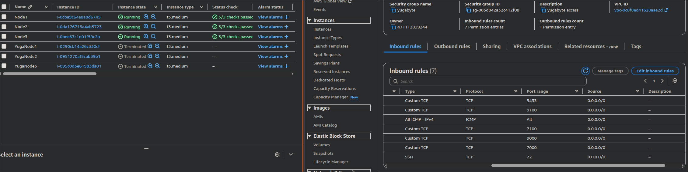
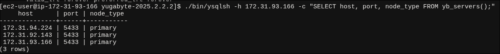
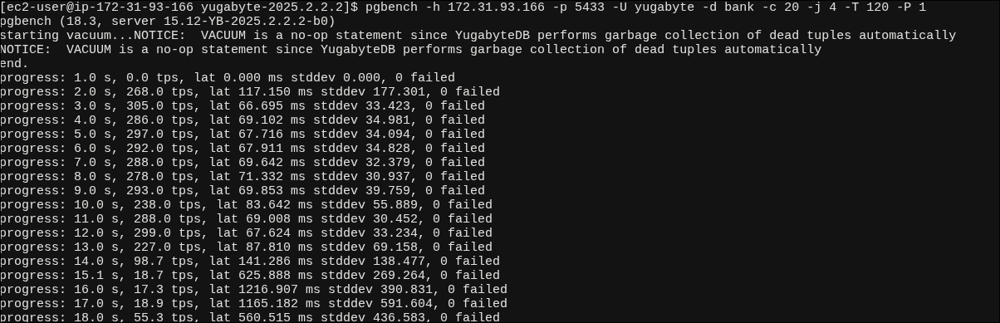
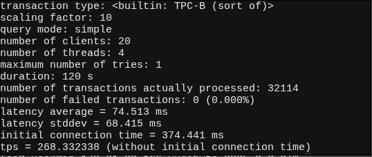

Example command to run the database
```bash
./bin/yugabyted start \
  --advertise_address=127.0.0.2 \
  --base_dir=$HOME/yugabyte-data/node2 \
  --join=127.0.0.1 \
  --cloud_location=local.local.rack2
 ```

Works
```bash
 jbrs@hq  ~/Documents/yugabyte/yugabyte-2025.2.2.2  ./bin/yugabyted status --base_dir=$HOME/yugabyte-data/node1                                                                                 

+--------------------------------------------------------------------------------------------------------+
|                                               yugabyted                                                |
+--------------------------------------------------------------------------------------------------------+
| Status              : Running.                                                                         |
| YSQL Status         : Ready                                                                            |
| Replication Factor  : 3                                                                                |
| YugabyteDB UI       : http://127.0.0.1:15433                                                           |
| JDBC                : jdbc:postgresql://127.0.0.1:5433/yugabyte?user=yugabyte&password=yugabyte        |
| YSQL                : bin/ysqlsh   -U yugabyte -d yugabyte                                             |
| YCQL                : bin/ycqlsh   -u cassandra                                                        |
| Data Dir            : /home/jbrs/yugabyte-data/node1/data                                              |
| Log Dir             : /home/jbrs/yugabyte-data/node1/logs                                              |
| Universe UUID       : f96d7995-973d-4f48-a75f-30e14cc2cec7                                             |
+--------------------------------------------------------------------------------------------------------+
```

All 3 ports joined

```bash
 jbrs@hq  ~/Documents/yugabyte/yugabyte-2025.2.2.2  ./bin/ysqlsh -h 127.0.0.1 -c "SELECT host, port, node_type, cloud, region, zone, public_ip FROM yb_servers();"
   host    | port | node_type | cloud | region | zone  | public_ip 
-----------+------+-----------+-------+--------+-------+-----------
 127.0.0.1 | 5433 | primary   | local | local  | rack1 | 127.0.0.1
 127.0.0.2 | 5433 | primary   | local | local  | rack2 | 127.0.0.2
 127.0.0.3 | 5433 | primary   | local | local  | rack3 | 127.0.0.3
(3 rows)
```

As we are running on postgres, `pgbench` is fully suitable for benchmarking:
Initialization:
```bash
 jbrs@hq  ~/Documents/yugabyte/yugabyte-2025.2.2.2  pgbench -i -h 127.0.0.1 -p 5433 -U yugabyte -d bank -s 10
dropping old tables...
NOTICE:  table "pgbench_accounts" does not exist, skipping
NOTICE:  table "pgbench_branches" does not exist, skipping
NOTICE:  table "pgbench_history" does not exist, skipping
NOTICE:  table "pgbench_tellers" does not exist, skipping
creating tables...
WARNING:  storage parameter fillfactor is unsupported, ignoring
WARNING:  storage parameter fillfactor is unsupported, ignoring
WARNING:  storage parameter fillfactor is unsupported, ignoring
generating data (client-side)...
NOTICE:  cannot perform COPY FREEZE on a YugaByte table
WARNING:  ROWS_PER_TRANSACTION is not supported in a transaction block
DETAIL:  Defaulting to using one transaction for all statements in the transaction block.
HINT:  Either run this COPY outside of a transaction block or set rows_per_transaction option to `0`  to remove this warning.
NOTICE:  cannot perform COPY FREEZE on a YugaByte table
WARNING:  ROWS_PER_TRANSACTION is not supported in a transaction block
DETAIL:  Defaulting to using one transaction for all statements in the transaction block.
HINT:  Either run this COPY outside of a transaction block or set rows_per_transaction option to `0`  to remove this warning.
NOTICE:  cannot perform COPY FREEZE on a YugaByte table (elapsed 0.01 s, remaining 0.05 s)
WARNING:  ROWS_PER_TRANSACTION is not supported in a transaction block
DETAIL:  Defaulting to using one transaction for all statements in the transaction block.
HINT:  Either run this COPY outside of a transaction block or set rows_per_transaction option to `0`  to remove this warning.
vacuuming...                                                                                
NOTICE:  VACUUM is a no-op statement since YugabyteDB performs garbage collection of dead tuples automatically
NOTICE:  VACUUM is a no-op statement since YugabyteDB performs garbage collection of dead tuples automatically
NOTICE:  VACUUM is a no-op statement since YugabyteDB performs garbage collection of dead tuples automatically
NOTICE:  VACUUM is a no-op statement since YugabyteDB performs garbage collection of dead tuples automatically
creating primary keys...
NOTICE:  table rewrite may lead to inconsistencies
DETAIL:  Concurrent DMLs may not be reflected in the new table.
HINT:  See https://github.com/yugabyte/yugabyte-db/issues/19860. Set 'ysql_suppress_unsafe_alter_notice' yb-tserver gflag to true to suppress this notice.
NOTICE:  table rewrite may lead to inconsistencies
DETAIL:  Concurrent DMLs may not be reflected in the new table.
HINT:  See https://github.com/yugabyte/yugabyte-db/issues/19860. Set 'ysql_suppress_unsafe_alter_notice' yb-tserver gflag to true to suppress this notice.
NOTICE:  table rewrite may lead to inconsistencies
DETAIL:  Concurrent DMLs may not be reflected in the new table.
HINT:  See https://github.com/yugabyte/yugabyte-db/issues/19860. Set 'ysql_suppress_unsafe_alter_notice' yb-tserver gflag to true to suppress this notice.
done in 15.73 s (drop tables 0.01 s, create tables 0.62 s, client-side generate 3.97 s, vacuum 0.83 s, primary keys 10.32 s).
```

2 minute benchmark:
```bash
jbrs@hq  ~/Documents/yugabyte/yugabyte-2025.2.2.2  pgbench -h 127.0.0.1 -p 5433 -U yugabyte -d bank -c 20 -j 4 -T 120 -P 1
pgbench (18.3, server 15.12-YB-2025.2.2.2-b0)
starting vacuum...NOTICE:  VACUUM is a no-op statement since YugabyteDB performs garbage collection of dead tuples automatically
NOTICE:  VACUUM is a no-op statement since YugabyteDB performs garbage collection of dead tuples automatically
end.
progress: 1.0 s, 1187.9 tps, lat 14.621 ms stddev 21.444, 0 failed
progress: 2.0 s, 1197.0 tps, lat 16.512 ms stddev 25.366, 0 failed
progress: 3.0 s, 1270.0 tps, lat 15.993 ms stddev 25.941, 0 failed
progress: 4.0 s, 1106.0 tps, lat 18.057 ms stddev 28.634, 0 failed
progress: 5.0 s, 1399.0 tps, lat 14.636 ms stddev 22.678, 0 failed
progress: 6.0 s, 991.0 tps, lat 19.702 ms stddev 30.780, 0 failed
progress: 7.0 s, 1312.0 tps, lat 15.242 ms stddev 23.004, 0 failed
progress: 8.0 s, 1222.0 tps, lat 16.436 ms stddev 26.905, 0 failed
progress: 9.0 s, 1302.0 tps, lat 15.366 ms stddev 23.857, 0 failed
progress: 10.0 s, 1316.0 tps, lat 15.314 ms stddev 23.791, 0 failed
progress: 11.0 s, 1064.0 tps, lat 18.325 ms stddev 26.868, 0 failed
progress: 12.0 s, 1157.0 tps, lat 17.682 ms stddev 28.288, 0 failed
progress: 13.0 s, 1279.0 tps, lat 15.548 ms stddev 24.762, 0 failed
progress: 14.0 s, 1536.0 tps, lat 13.314 ms stddev 19.926, 0 failed
progress: 15.0 s, 1069.0 tps, lat 18.157 ms stddev 27.311, 0 failed
progress: 16.0 s, 1424.0 tps, lat 14.270 ms stddev 22.391, 0 failed
progress: 17.0 s, 1177.0 tps, lat 16.967 ms stddev 24.778, 0 failed
progress: 18.0 s, 1147.0 tps, lat 17.799 ms stddev 28.150, 0 failed
progress: 19.0 s, 1236.0 tps, lat 15.675 ms stddev 25.636, 0 failed
progress: 20.0 s, 1332.0 tps, lat 15.324 ms stddev 25.000, 0 failed
progress: 21.0 s, 1192.0 tps, lat 16.855 ms stddev 26.010, 0 failed
progress: 22.0 s, 1416.0 tps, lat 14.299 ms stddev 21.892, 0 failed
progress: 23.0 s, 1360.0 tps, lat 14.703 ms stddev 24.227, 0 failed
progress: 24.0 s, 1256.0 tps, lat 15.515 ms stddev 24.497, 0 failed
progress: 25.0 s, 1111.0 tps, lat 18.464 ms stddev 28.844, 0 failed
progress: 26.0 s, 1160.9 tps, lat 17.106 ms stddev 26.532, 0 failed
progress: 27.0 s, 1311.1 tps, lat 15.162 ms stddev 22.652, 0 failed
progress: 28.0 s, 1230.0 tps, lat 16.126 ms stddev 26.117, 0 failed
progress: 29.0 s, 1336.0 tps, lat 15.277 ms stddev 24.576, 0 failed
progress: 30.0 s, 1199.0 tps, lat 16.683 ms stddev 26.225, 0 failed
progress: 31.0 s, 1219.0 tps, lat 16.198 ms stddev 24.778, 0 failed
progress: 32.0 s, 1216.0 tps, lat 16.380 ms stddev 25.371, 0 failed
progress: 33.0 s, 1575.0 tps, lat 12.846 ms stddev 18.686, 0 failed
progress: 34.0 s, 1088.0 tps, lat 18.391 ms stddev 29.399, 0 failed
progress: 35.0 s, 1408.9 tps, lat 14.273 ms stddev 21.523, 0 failed
progress: 36.0 s, 1236.0 tps, lat 16.304 ms stddev 25.996, 0 failed
progress: 37.0 s, 1140.0 tps, lat 17.537 ms stddev 25.544, 0 failed
progress: 38.0 s, 1564.0 tps, lat 12.499 ms stddev 19.048, 0 failed
progress: 39.0 s, 1572.0 tps, lat 12.991 ms stddev 20.152, 0 failed
progress: 40.0 s, 1505.0 tps, lat 13.223 ms stddev 20.494, 0 failed
progress: 41.0 s, 1277.0 tps, lat 15.481 ms stddev 23.379, 0 failed
progress: 42.0 s, 1265.8 tps, lat 16.015 ms stddev 25.312, 0 failed
progress: 43.0 s, 1075.2 tps, lat 18.411 ms stddev 27.861, 0 failed
progress: 44.0 s, 1399.1 tps, lat 14.296 ms stddev 21.929, 0 failed
progress: 45.0 s, 1386.0 tps, lat 14.621 ms stddev 21.912, 0 failed
progress: 46.0 s, 1465.9 tps, lat 13.638 ms stddev 20.676, 0 failed
progress: 47.0 s, 1433.9 tps, lat 13.943 ms stddev 22.019, 0 failed
progress: 48.0 s, 1272.1 tps, lat 15.721 ms stddev 24.377, 0 failed
progress: 49.0 s, 1031.0 tps, lat 19.335 ms stddev 29.088, 0 failed
progress: 50.0 s, 1537.0 tps, lat 12.999 ms stddev 20.303, 0 failed
progress: 51.0 s, 1347.0 tps, lat 14.895 ms stddev 23.281, 0 failed
progress: 52.0 s, 1324.0 tps, lat 15.125 ms stddev 23.318, 0 failed
progress: 53.0 s, 1343.0 tps, lat 14.847 ms stddev 22.832, 0 failed
progress: 54.0 s, 1410.0 tps, lat 14.217 ms stddev 21.253, 0 failed
progress: 55.0 s, 1116.0 tps, lat 17.896 ms stddev 28.637, 0 failed
progress: 56.0 s, 1193.0 tps, lat 16.764 ms stddev 25.279, 0 failed
progress: 57.0 s, 1206.1 tps, lat 16.621 ms stddev 26.074, 0 failed
progress: 58.0 s, 1214.0 tps, lat 16.475 ms stddev 25.540, 0 failed
progress: 59.0 s, 1460.0 tps, lat 13.670 ms stddev 21.187, 0 failed
progress: 60.0 s, 1469.9 tps, lat 13.456 ms stddev 20.765, 0 failed
progress: 61.0 s, 999.1 tps, lat 20.224 ms stddev 30.200, 0 failed
progress: 62.0 s, 1229.9 tps, lat 16.167 ms stddev 25.280, 0 failed
progress: 63.0 s, 1355.0 tps, lat 14.885 ms stddev 23.196, 0 failed
progress: 64.0 s, 1172.0 tps, lat 17.067 ms stddev 25.793, 0 failed
progress: 65.0 s, 1564.0 tps, lat 12.776 ms stddev 18.551, 0 failed
progress: 66.0 s, 1397.9 tps, lat 14.281 ms stddev 21.549, 0 failed
progress: 67.0 s, 1093.0 tps, lat 18.224 ms stddev 29.071, 0 failed
progress: 68.0 s, 1273.1 tps, lat 15.764 ms stddev 23.945, 0 failed
progress: 69.0 s, 1300.9 tps, lat 15.010 ms stddev 24.720, 0 failed
progress: 70.0 s, 1276.1 tps, lat 15.977 ms stddev 24.124, 0 failed
progress: 71.0 s, 1405.9 tps, lat 14.144 ms stddev 21.415, 0 failed
progress: 72.0 s, 1016.1 tps, lat 19.173 ms stddev 29.411, 0 failed
progress: 73.0 s, 1105.9 tps, lat 18.506 ms stddev 29.289, 0 failed
progress: 74.0 s, 1274.0 tps, lat 15.641 ms stddev 23.726, 0 failed
progress: 75.0 s, 1119.0 tps, lat 17.560 ms stddev 26.368, 0 failed
progress: 76.0 s, 1025.0 tps, lat 19.358 ms stddev 30.884, 0 failed
progress: 77.0 s, 1232.1 tps, lat 16.307 ms stddev 26.567, 0 failed
progress: 78.0 s, 1286.9 tps, lat 15.511 ms stddev 23.826, 0 failed
progress: 79.0 s, 1318.0 tps, lat 15.188 ms stddev 24.485, 0 failed
progress: 80.0 s, 1287.0 tps, lat 15.208 ms stddev 23.547, 0 failed
progress: 81.0 s, 1368.0 tps, lat 14.787 ms stddev 23.283, 0 failed
progress: 82.0 s, 1440.0 tps, lat 13.696 ms stddev 20.666, 0 failed
progress: 83.0 s, 1032.0 tps, lat 19.732 ms stddev 29.105, 0 failed
progress: 84.0 s, 1176.0 tps, lat 16.788 ms stddev 26.774, 0 failed
progress: 85.0 s, 1281.0 tps, lat 15.853 ms stddev 23.763, 0 failed
progress: 86.0 s, 1302.0 tps, lat 15.185 ms stddev 23.532, 0 failed
progress: 87.0 s, 1224.0 tps, lat 16.330 ms stddev 24.800, 0 failed
progress: 88.0 s, 1142.0 tps, lat 17.531 ms stddev 26.526, 0 failed
progress: 89.0 s, 1365.0 tps, lat 15.178 ms stddev 22.676, 0 failed
progress: 90.0 s, 1443.0 tps, lat 13.925 ms stddev 21.545, 0 failed
progress: 91.0 s, 1200.0 tps, lat 16.092 ms stddev 24.796, 0 failed
progress: 92.0 s, 1221.0 tps, lat 16.255 ms stddev 24.182, 0 failed
progress: 93.0 s, 1313.0 tps, lat 15.451 ms stddev 24.475, 0 failed
progress: 94.0 s, 1388.1 tps, lat 14.850 ms stddev 23.653, 0 failed
progress: 95.0 s, 1184.9 tps, lat 16.495 ms stddev 26.357, 0 failed
progress: 96.0 s, 1230.0 tps, lat 16.318 ms stddev 26.095, 0 failed
progress: 97.0 s, 1132.0 tps, lat 17.546 ms stddev 28.517, 0 failed
progress: 98.0 s, 1432.0 tps, lat 13.864 ms stddev 20.835, 0 failed
progress: 99.0 s, 1442.0 tps, lat 14.028 ms stddev 22.973, 0 failed
progress: 100.0 s, 1190.0 tps, lat 16.719 ms stddev 26.776, 0 failed
progress: 101.0 s, 1419.0 tps, lat 14.373 ms stddev 21.546, 0 failed
progress: 102.0 s, 1052.0 tps, lat 18.914 ms stddev 28.212, 0 failed
progress: 103.0 s, 1443.0 tps, lat 14.155 ms stddev 21.641, 0 failed
progress: 104.0 s, 1229.0 tps, lat 16.189 ms stddev 24.179, 0 failed
progress: 105.0 s, 1489.0 tps, lat 13.151 ms stddev 20.165, 0 failed
progress: 106.0 s, 1144.0 tps, lat 17.240 ms stddev 26.347, 0 failed
progress: 107.0 s, 1303.0 tps, lat 15.301 ms stddev 23.987, 0 failed
progress: 108.0 s, 1236.0 tps, lat 16.435 ms stddev 27.701, 0 failed
progress: 109.0 s, 1258.0 tps, lat 15.853 ms stddev 25.532, 0 failed
progress: 110.0 s, 1346.0 tps, lat 15.275 ms stddev 24.018, 0 failed
progress: 111.0 s, 1234.0 tps, lat 15.605 ms stddev 24.216, 0 failed
progress: 112.0 s, 1166.0 tps, lat 17.530 ms stddev 26.902, 0 failed
progress: 113.0 s, 1159.0 tps, lat 17.103 ms stddev 26.333, 0 failed
progress: 114.0 s, 1131.0 tps, lat 17.309 ms stddev 26.738, 0 failed
progress: 115.0 s, 1345.9 tps, lat 15.285 ms stddev 26.894, 0 failed
progress: 116.0 s, 1213.0 tps, lat 16.207 ms stddev 24.926, 0 failed
progress: 117.0 s, 1392.0 tps, lat 14.552 ms stddev 22.563, 0 failed
progress: 118.0 s, 1125.0 tps, lat 18.090 ms stddev 28.153, 0 failed
progress: 119.0 s, 1334.1 tps, lat 15.053 ms stddev 23.737, 0 failed
progress: 120.0 s, 1216.0 tps, lat 16.060 ms stddev 25.506, 0 failed
transaction type: <builtin: TPC-B (sort of)>
scaling factor: 10
query mode: simple
number of clients: 20
number of threads: 4
maximum number of tries: 1
duration: 120 s
number of transactions actually processed: 152538
number of failed transactions: 0 (0.000%)
latency average = 15.730 ms
latency stddev = 24.609 ms
initial connection time = 76.866 ms
tps = 1271.318979 (without initial connection time)
```

Basic comparison to CockroachDB:

| Metric | CockroachDB (local) | YugabyteDB (local) |
|---|---|---|
| Total transactions | 152,706 | 152,538 |
| Throughput | 1,272.5 ops/sec | 1,271.3 TPS |
| Avg latency | 18.9 ms | 15.7 ms |
| Errors | 0 | 0 |

We have to take into account that it was run on different machines

Another test result with killing second node manually after some time:
```bash
progress: 28.0 s, 1358.0 tps, lat 14.964 ms stddev 22.761, 0 failed
progress: 29.0 s, 1319.9 tps, lat 13.721 ms stddev 21.722, 0 failed
progress: 30.0 s, 0.0 tps, lat 0.000 ms stddev 0.000, 0 failed
progress: 31.0 s, 0.0 tps, lat 0.000 ms stddev 0.000, 0 failed
progress: 32.0 s, 0.0 tps, lat 0.000 ms stddev 0.000, 0 failed
progress: 33.0 s, 1177.1 tps, lat 69.498 ms stddev 411.457, 0 failed
```
# AWS

EC2 and SG setup:





Benchmark initialization:


Basic benchmark (all nodes functional):




Benchmark with node failing in the meantime:
```bash
[ec2-user@ip-172-31-93-166 yugabyte-2025.2.2.2]$ pgbench -h 172.31.93.166 -p 5433 -U yugabyte -d bank -c 20 -j 4 -T 120 -P 1
pgbench (18.3, server 15.12-YB-2025.2.2.2-b0)
starting vacuum...NOTICE:  VACUUM is a no-op statement since YugabyteDB performs garbage collection of dead tuples automatically
NOTICE:  VACUUM is a no-op statement since YugabyteDB performs garbage collection of dead tuples automatically
end.
progress: 1.0 s, 0.0 tps, lat 0.000 ms stddev 0.000, 0 failed
progress: 2.0 s, 201.0 tps, lat 145.722 ms stddev 219.528, 0 failed
progress: 3.0 s, 266.0 tps, lat 75.305 ms stddev 32.735, 0 failed
progress: 4.0 s, 270.0 tps, lat 74.221 ms stddev 36.798, 0 failed
progress: 5.0 s, 259.9 tps, lat 77.936 ms stddev 42.677, 0 failed
progress: 6.0 s, 257.1 tps, lat 77.832 ms stddev 36.474, 0 failed
progress: 7.0 s, 262.0 tps, lat 75.128 ms stddev 31.360, 0 failed
progress: 8.0 s, 281.0 tps, lat 71.429 ms stddev 34.178, 0 failed
progress: 9.0 s, 268.0 tps, lat 74.852 ms stddev 34.949, 0 failed
progress: 10.0 s, 256.0 tps, lat 77.758 ms stddev 42.433, 0 failed
progress: 11.0 s, 273.0 tps, lat 73.430 ms stddev 31.769, 0 failed
progress: 12.0 s, 257.0 tps, lat 78.642 ms stddev 34.634, 0 failed
progress: 13.0 s, 240.0 tps, lat 79.877 ms stddev 31.050, 0 failed
progress: 14.0 s, 272.9 tps, lat 75.904 ms stddev 40.077, 0 failed
progress: 15.0 s, 265.1 tps, lat 75.925 ms stddev 40.330, 0 failed
progress: 16.0 s, 271.0 tps, lat 73.760 ms stddev 26.861, 0 failed
progress: 17.0 s, 265.0 tps, lat 74.486 ms stddev 35.657, 0 failed
progress: 18.0 s, 271.0 tps, lat 74.876 ms stddev 35.918, 0 failed
progress: 19.0 s, 257.0 tps, lat 76.500 ms stddev 32.793, 0 failed
progress: 20.0 s, 266.0 tps, lat 76.107 ms stddev 34.982, 0 failed
progress: 21.0 s, 273.0 tps, lat 72.984 ms stddev 29.860, 0 failed
progress: 22.0 s, 261.0 tps, lat 75.930 ms stddev 44.789, 0 failed
progress: 23.0 s, 249.0 tps, lat 80.975 ms stddev 38.501, 0 failed
progress: 24.0 s, 237.9 tps, lat 82.084 ms stddev 41.621, 0 failed
progress: 25.0 s, 242.1 tps, lat 84.546 ms stddev 54.739, 0 failed
progress: 26.0 s, 249.9 tps, lat 79.317 ms stddev 39.923, 0 failed
progress: 27.0 s, 264.1 tps, lat 74.144 ms stddev 40.028, 0 failed
progress: 28.0 s, 252.0 tps, lat 81.308 ms stddev 43.175, 0 failed
progress: 29.0 s, 252.0 tps, lat 78.898 ms stddev 45.618, 0 failed
progress: 30.0 s, 259.0 tps, lat 77.901 ms stddev 45.101, 0 failed
progress: 31.0 s, 260.0 tps, lat 77.141 ms stddev 35.114, 0 failed
progress: 32.0 s, 265.0 tps, lat 76.327 ms stddev 36.201, 0 failed
progress: 33.0 s, 268.0 tps, lat 73.647 ms stddev 37.986, 0 failed
progress: 34.0 s, 259.0 tps, lat 78.029 ms stddev 36.894, 0 failed
progress: 35.0 s, 262.0 tps, lat 75.366 ms stddev 34.044, 0 failed
progress: 36.0 s, 264.0 tps, lat 75.727 ms stddev 39.276, 0 failed
progress: 37.0 s, 254.0 tps, lat 79.145 ms stddev 43.209, 0 failed
progress: 38.0 s, 260.0 tps, lat 75.042 ms stddev 46.029, 0 failed
progress: 39.0 s, 259.0 tps, lat 79.373 ms stddev 38.437, 0 failed
progress: 40.0 s, 245.0 tps, lat 80.810 ms stddev 36.993, 0 failed
progress: 41.0 s, 246.0 tps, lat 81.633 ms stddev 50.004, 0 failed
progress: 42.0 s, 265.0 tps, lat 75.724 ms stddev 39.857, 0 failed
progress: 43.0 s, 257.0 tps, lat 77.419 ms stddev 40.666, 0 failed
progress: 44.0 s, 266.0 tps, lat 75.739 ms stddev 32.587, 0 failed
progress: 45.0 s, 248.0 tps, lat 79.239 ms stddev 39.718, 0 failed
progress: 46.0 s, 262.0 tps, lat 77.726 ms stddev 34.320, 0 failed
progress: 47.0 s, 242.0 tps, lat 81.707 ms stddev 46.292, 0 failed
progress: 48.0 s, 255.0 tps, lat 75.571 ms stddev 44.584, 0 failed
progress: 49.0 s, 257.0 tps, lat 81.564 ms stddev 42.031, 0 failed
progress: 50.0 s, 251.0 tps, lat 79.303 ms stddev 39.539, 0 failed
progress: 51.0 s, 278.0 tps, lat 72.104 ms stddev 36.380, 0 failed
progress: 52.0 s, 10.0 tps, lat 130.260 ms stddev 80.299, 0 failed
progress: 53.0 s, 0.0 tps, lat 0.000 ms stddev 0.000, 0 failed
progress: 54.0 s, 0.0 tps, lat 0.000 ms stddev 0.000, 0 failed
progress: 55.0 s, 0.0 tps, lat 0.000 ms stddev 0.000, 0 failed
progress: 56.0 s, 0.0 tps, lat 0.000 ms stddev 0.000, 0 failed
progress: 57.0 s, 0.0 tps, lat 0.000 ms stddev 0.000, 0 failed
progress: 58.0 s, 0.0 tps, lat 0.000 ms stddev 0.000, 0 failed
progress: 59.0 s, 0.0 tps, lat 0.000 ms stddev 0.000, 0 failed
progress: 60.0 s, 0.0 tps, lat 0.000 ms stddev 0.000, 0 failed
progress: 61.0 s, 0.0 tps, lat 0.000 ms stddev 0.000, 0 failed
progress: 62.0 s, 0.0 tps, lat 0.000 ms stddev 0.000, 0 failed
progress: 63.0 s, 0.0 tps, lat 0.000 ms stddev 0.000, 0 failed
progress: 64.0 s, 0.0 tps, lat 0.000 ms stddev 0.000, 0 failed
progress: 65.0 s, 0.0 tps, lat 0.000 ms stddev 0.000, 0 failed
progress: 66.0 s, 0.0 tps, lat 0.000 ms stddev 0.000, 0 failed
progress: 67.0 s, 0.0 tps, lat 0.000 ms stddev 0.000, 0 failed
progress: 68.0 s, 0.0 tps, lat 0.000 ms stddev 0.000, 0 failed
progress: 69.0 s, 0.0 tps, lat 0.000 ms stddev 0.000, 0 failed
pgbench: error: client 7 script 0 aborted in command 10 query 0: ERROR:  UpdateTransaction: tablet_id: "9fd1324baad848349e5bb1a4e1db396b" state { transaction_id: "{\006\233\251drA\361\220\021\354Q\311\031{7" status: COMMITTED tablets: "7ae2cac6c2ec4cf0ae8817f8e3eedd74" tablets: "0f04f37f9c4645fa8a2ea7f2031635d1" tablets: "f325e0f5c9de4eeb93105611278d3f7a" tablets: "475aca98926a4ea1a70355a4dcf69fa3" aborted { } } propagated_hybrid_time: 7282609533941030912, retrier: { task_id: -1 state: kRunning deadline: 1818.913s (passed 9.479s of 5.000s) } passed its deadline 1818.913s (passed 9.479s of 5.000s): Leader does not have a valid lease (yb/consensus/consensus.cc:166): This leader has not yet acquired a lease. (tablet server error 15)
pgbench: error: client 19 script 0 aborted in command 10 query 0: ERROR:  Attempted to commit expired transaction
pgbench: error: client 17 script 0 aborted in command 10 query 0: ERROR:  Attempted to commit expired transaction
pgbench: error: client 2 script 0 aborted in command 10 query 0: ERROR:  UpdateTransaction: tablet_id: "9c4b4ed7d41e4d35a9716057a4af27dc" state { transaction_id: "\221Z\317\346\306\230G\350\243\330\335^\262\254@C" status: COMMITTED tablets: "7ae2cac6c2ec4cf0ae8817f8e3eedd74" tablets: "0f04f37f9c4645fa8a2ea7f2031635d1" tablets: "f325e0f5c9de4eeb93105611278d3f7a" tablets: "475aca98926a4ea1a70355a4dcf69fa3" aborted { } } propagated_hybrid_time: 7282609533942497280, retrier: { task_id: -1 state: kRunning deadline: 1818.913s (passed 9.549s of 5.000s) } passed its deadline 1818.913s (passed 9.549s of 5.000s): Leader does not have a valid lease (yb/consensus/consensus.cc:166): This leader has not yet acquired a lease. (tablet server error 15)
progress: 70.0 s, 27.0 tps, lat 4205.531 ms stddev 7759.775, 6 failed
progress: 71.0 s, 52.0 tps, lat 49.329 ms stddev 89.647, 2 failed
progress: 72.0 s, 20.0 tps, lat 2853.925 ms stddev 6093.769, 0 failed
progress: 73.0 s, 243.0 tps, lat 117.224 ms stddev 306.866, 0 failed
progress: 74.0 s, 259.0 tps, lat 60.861 ms stddev 29.940, 0 failed
progress: 75.0 s, 254.0 tps, lat 64.385 ms stddev 31.918, 0 failed
progress: 76.0 s, 259.0 tps, lat 61.923 ms stddev 29.709, 0 failed
progress: 77.0 s, 260.0 tps, lat 61.278 ms stddev 34.764, 0 failed
progress: 78.0 s, 281.0 tps, lat 57.338 ms stddev 28.958, 0 failed
progress: 79.0 s, 260.0 tps, lat 61.010 ms stddev 25.786, 0 failed
progress: 80.0 s, 253.0 tps, lat 63.227 ms stddev 34.597, 0 failed
progress: 81.0 s, 260.0 tps, lat 61.165 ms stddev 23.722, 0 failed
progress: 82.0 s, 260.0 tps, lat 62.126 ms stddev 35.206, 0 failed
progress: 83.0 s, 233.0 tps, lat 67.563 ms stddev 40.384, 0 failed
progress: 84.0 s, 270.0 tps, lat 59.750 ms stddev 28.036, 0 failed
progress: 85.0 s, 267.0 tps, lat 59.419 ms stddev 26.058, 0 failed
progress: 86.0 s, 248.0 tps, lat 65.786 ms stddev 31.592, 0 failed
progress: 87.0 s, 227.0 tps, lat 70.251 ms stddev 34.429, 0 failed
progress: 88.0 s, 249.0 tps, lat 64.118 ms stddev 32.339, 0 failed
progress: 89.0 s, 268.0 tps, lat 60.020 ms stddev 31.472, 0 failed
progress: 90.0 s, 273.0 tps, lat 58.109 ms stddev 27.059, 0 failed
progress: 91.0 s, 267.0 tps, lat 60.478 ms stddev 31.252, 0 failed
progress: 92.0 s, 261.0 tps, lat 60.793 ms stddev 31.836, 0 failed
progress: 93.0 s, 257.0 tps, lat 61.274 ms stddev 31.696, 0 failed
progress: 94.0 s, 236.0 tps, lat 68.382 ms stddev 34.170, 0 failed
progress: 95.0 s, 215.0 tps, lat 74.756 ms stddev 38.225, 0 failed
progress: 96.0 s, 243.0 tps, lat 66.601 ms stddev 32.810, 0 failed
progress: 97.0 s, 238.0 tps, lat 66.916 ms stddev 32.456, 0 failed
progress: 98.0 s, 242.0 tps, lat 66.119 ms stddev 38.719, 0 failed
progress: 99.0 s, 238.1 tps, lat 66.622 ms stddev 31.468, 0 failed
progress: 100.0 s, 262.0 tps, lat 61.106 ms stddev 32.284, 0 failed
progress: 101.0 s, 90.0 tps, lat 142.067 ms stddev 159.743, 0 failed
progress: 102.0 s, 60.0 tps, lat 294.649 ms stddev 276.412, 0 failed
progress: 103.0 s, 244.9 tps, lat 72.254 ms stddev 56.132, 0 failed
progress: 104.0 s, 267.1 tps, lat 59.523 ms stddev 20.045, 0 failed
progress: 105.0 s, 271.0 tps, lat 59.135 ms stddev 25.736, 0 failed
progress: 106.0 s, 272.0 tps, lat 59.644 ms stddev 23.419, 0 failed
progress: 107.0 s, 274.0 tps, lat 57.808 ms stddev 22.400, 0 failed
progress: 108.0 s, 278.0 tps, lat 57.598 ms stddev 22.909, 0 failed
progress: 109.0 s, 276.0 tps, lat 58.056 ms stddev 24.382, 0 failed
progress: 110.0 s, 268.0 tps, lat 58.992 ms stddev 22.698, 0 failed
progress: 111.0 s, 276.0 tps, lat 58.692 ms stddev 23.463, 0 failed
progress: 112.0 s, 271.0 tps, lat 58.722 ms stddev 23.191, 0 failed
progress: 113.0 s, 269.0 tps, lat 59.369 ms stddev 26.235, 0 failed
progress: 114.0 s, 270.0 tps, lat 59.183 ms stddev 24.093, 0 failed
progress: 115.0 s, 293.0 tps, lat 55.018 ms stddev 20.157, 0 failed
progress: 116.0 s, 283.0 tps, lat 56.410 ms stddev 21.372, 0 failed
progress: 117.0 s, 249.0 tps, lat 64.076 ms stddev 35.646, 0 failed
progress: 118.0 s, 260.0 tps, lat 59.520 ms stddev 25.755, 0 failed
progress: 119.0 s, 35.0 tps, lat 368.837 ms stddev 256.713, 0 failed
progress: 120.0 s, 99.5 tps, lat 171.729 ms stddev 179.315, 0 failed
transaction type: <builtin: TPC-B (sort of)>
scaling factor: 10
query mode: simple
number of clients: 20
number of threads: 4
maximum number of tries: 1
duration: 120 s
number of transactions actually processed: 24737
number of failed transactions: 8 (0.032%)
latency average = 79.502 ms
latency stddev = 352.268 ms
initial connection time = 479.587 ms
tps = 206.725596 (without initial connection time)
pgbench: error: Run was aborted; the above results are incomplete.